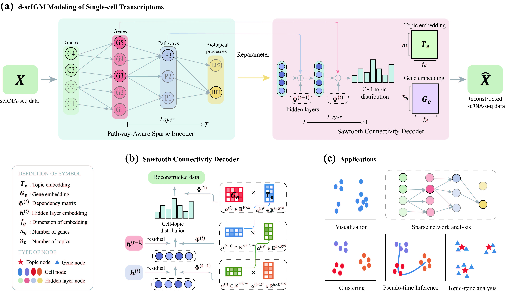

# d-scIGM: deep Interpretable Generative Model called for single-cell data analysis

The full description of d-scIGM and its application on published single cell RNA-seq datasets are available.

Download archive with preprocessed data at: https://drive.google.com/drive/folders/1XC4Rhm-c6tMgjPJMCj1FpzW-NqTnM1Fz.

The repository includes detailed installation instructions and requirements, scripts and demos.


## 1 Schematic overview of d-scIGM and applications.



**(a)** The overview of d-scIGM, which consists of a PAS encoder and a SC decoder. Given scRNA-seq data as input, the PAS encoder maps it to a low-dimensional latent space. The SC decoder learns topic embeddings and gene embeddings during reconstruction, which ensures the interpretability of the model. **(b)** The SC decoder’s network architecture. $\boldsymbol{\alpha}^{(t)}$ is the embedding of the $t$-th layer, and the embedding of different layers is mapped to a shared embedding layer through the SC technology, thereby coupling the relationship between different hidden layers.  **(c)** Schematic representation of different applications of d-scIGM.
## 2 Requirements

+ Linux/UNIX/Windows system
+ Python >= 3.8
+ torch == 1.8.1
+ scanpy == 1.9.1


## 3 Usage

### Data format

d-scIGM requires cell-by-cell-gene matrix and cell type information to be entered in .csv object format.

### Training

```bash
cd model
python main.py
```

We provide default data for users to understand and debug d-scIGM code.

### evaluation

We provide tutorial as shown in directory tutorial/{Cell representation,Pathway enrichment,Time-trajectory inference, and Survival analysis} for introducing the usage of d-scIGM and reproducing the main result of our paper.

## Reference

If you use `d-scIGM` in your work, please cite